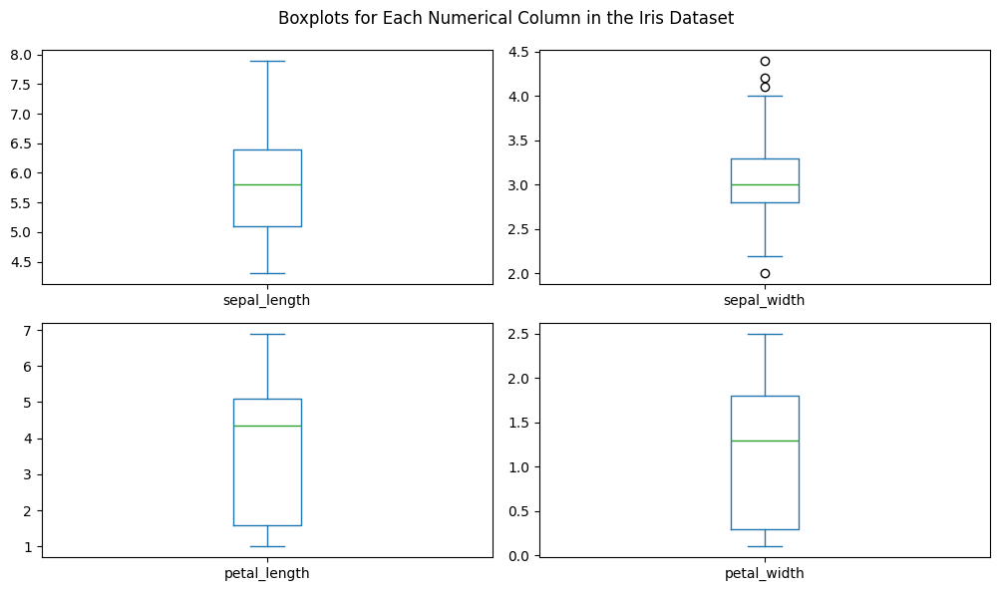
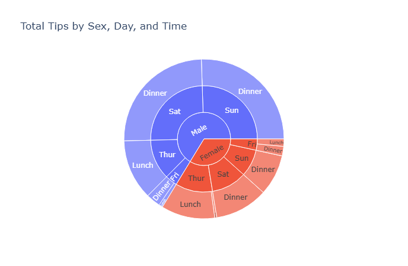
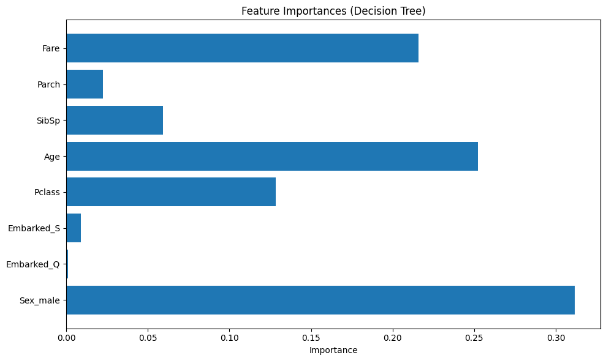

# Exercise 1: Generate and Explore a Random DataFrame

- This script demonstrates how to create a **Pandas DataFrame** populated with **random numbers**.  
- It uses the `numpy` library to generate a 5x4 matrix of random values and `pandas` to organize the data into a structured table.  
- Custom **row labels** (`A` to `E`) and **column headers** (`Col1` to `Col4`) are defined for clarity.  
- The DataFrame is printed to visually inspect the values.  
- The **shape** of the DataFrame (number of rows and columns) is displayed using `.shape`.  
- The `.describe()` method is used to provide a **summary of statistical measures** such as:
  - Count
  - Mean
  - Standard deviation
  - Minimum and maximum values
  - 25th, 50th (median), and 75th percentiles  
- This exercise is ideal for beginners to practice working with random data and basic DataFrame analysis using Pandas.

# 📌 Example Output:

```text
DataFrame:
       Col1     Col2     Col3     Col4
A   0.5821   -1.2047   -0.3892   1.2336
B  -0.4762    0.9314    0.1760  -0.9995
C  -1.3126   -0.0701    0.9404   0.2265
D   0.7488    0.3139   -0.1842   0.5561
E   1.0152   -1.1243    1.2039  -0.6713

Shape of DataFrame:
(5, 4)

Statistics Summary:
            Col1      Col2      Col3      Col4
count   5.000000  5.000000  5.000000  5.000000
mean    0.1115    -0.2308    0.3494    0.0691
std     0.9909     0.9794    0.7855    0.8894
min    -1.3126    -1.2047   -0.3892   -0.9995
25%    -0.4762    -1.1243   -0.1842   -0.6713
50%     0.5821    -0.0701    0.1760    0.2265
75%     0.7488     0.3139    0.9404    0.5561
max     1.0152     0.9314    1.2039    1.2336
```
# Exercise 2: Boxplot Visualization of the Iris Dataset

- This code loads the **Iris dataset** using the `seaborn` library, which provides easy access to common sample datasets.  
- The Iris dataset contains **measurements of iris flowers**, including numerical columns like:
  - `sepal_length`
  - `sepal_width`
  - `petal_length`
  - `petal_width`  
- A **boxplot** is generated for each numerical column using the `matplotlib` library.  
- Boxplots help visualize:
  - The **distribution** of data
  - **Median** value (middle line)
  - **Interquartile range** (box area)
  - **Outliers** (individual points beyond whiskers)  
- The `plot(kind='box', ...)` method is used with `subplots=True` to create separate plots for each column.  
- The layout is arranged in a 2x2 grid and displayed using `plt.show()`.  
- This exercise introduces how to perform **basic data visualization** in Python using real-world datasets.

# 📌 Example Output:


# Exercise 3: Visualizing Restaurant Tips with a Sunburst Chart

# Visualizing Restaurant Tips with a Sunburst Chart

## Overview
This exercise demonstrates how to create a sunburst chart using Plotly Express, visualizing total tips grouped by gender, day, and time from the `Tips` dataset in Seaborn.

## Steps:

1. **Install libraries**:
   ```bash
   pip install seaborn plotly
2. **Import libraries**:
   ```import seaborn as sns
   import plotly.express as px
3. **Load the Dataset**:
   ```
   tips = sns.load_dataset("tips")
4. **Create the sunburst chart**:
   ```
   fig = px.sunburst(
    tips, 
    path=['sex', 'day', 'time'],
    values='tip',
    title='Total Tips by Sex, Day, and Time'
    )
    fig.show()
# 📌 Example Output:



# Exercise 4: Predicting Tips with Linear Regression

## Overview
This exercise trains a simple linear regression model to predict tip amount based on the total restaurant bill using the Tips dataset.

## Steps:

1. **Install scikit-learn (if needed)**:
   ```bash
   pip install scikit-learn seaborn
2. **Import and load data**:
    ```
    import seaborn as sns
    tips = sns.load_dataset("tips")
3. **Train a model**:
   ```
    from sklearn.linear_model import LinearRegression
    X = tips[['total_bill']]
    y = tips['tip']
    model = LinearRegression()
    model.fit(X, y)
4. **Make a prediction**:
    ```
    predicted_tip = model.predict([[50]])  # Predict tip for $50 bill
    print(predicted_tip)

# 📌 Example Output:
```text
Predicted tip for a $50 bill: $6.17
```

# Exercise 2: Titanic Decision Tree with Categorical Features

## Overview

In this exercise, we build a Decision Tree model using the Titanic dataset. We include categorical features such as `Sex`, `SibSp`, `Parch`, and `Embarked` using One-Hot Encoding.

## Features Used

- **Numerical**: Pclass, Age, SibSp, Parch, Fare
- **Categorical**: Sex, Embarked (encoded)

## Model & Steps

1. Load and clean data
2. Encode categorical features with OneHotEncoder
3. Train a DecisionTreeClassifier using a scikit-learn Pipeline
4. Evaluate the model
5. Predict for a sample passenger
6. Plot feature importances

## Sample Prediction

Passenger:
- Female, 2nd class
- Age: 28
- 1 sibling/spouse
- 0 parents/children
- Fare: $30
- Embarked from Southampton

**Prediction**: Survived ✅

## Results

- **Model Accuracy**: ~0.78 (will vary)
- **Most Important Features**: Sex, Fare, Pclass, etc.

## Chart

Bar chart shows how much each feature contributes to survival prediction based on the trained tree.

## Conclusion

Adding categorical features and encoding them improves model performance and gives better insights into survival patterns.

# 📌 Example Output:
